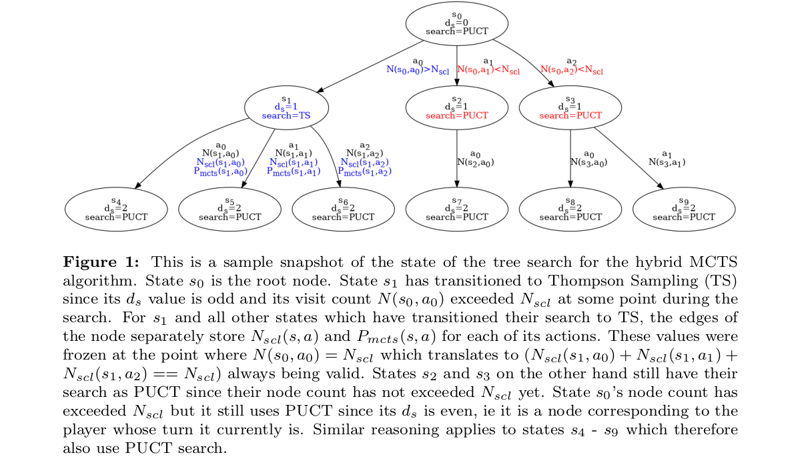
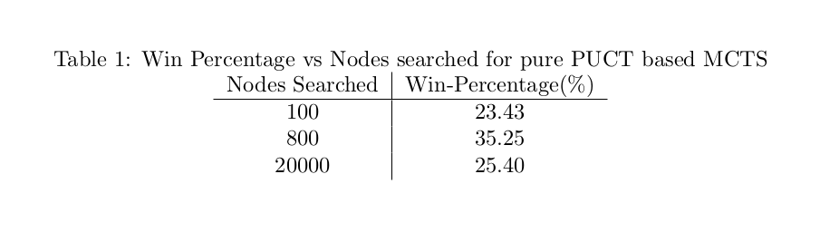
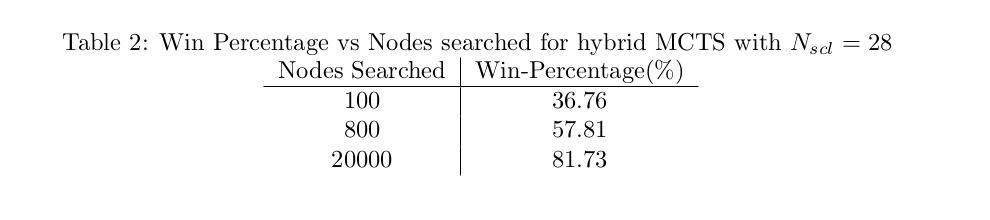
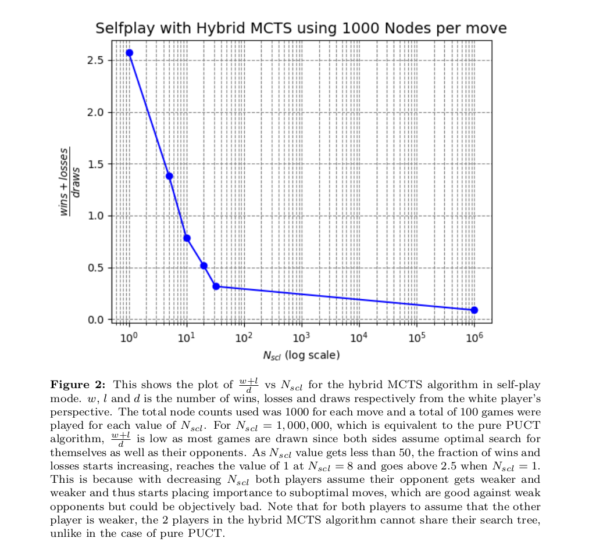
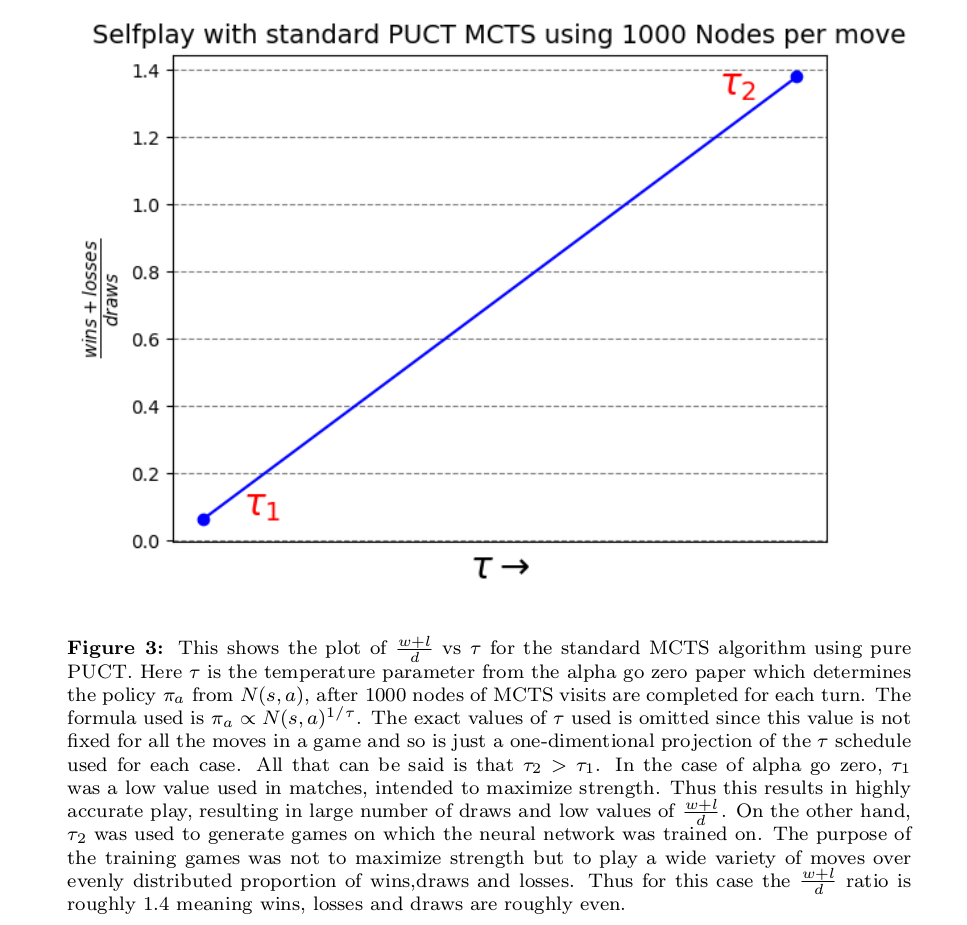
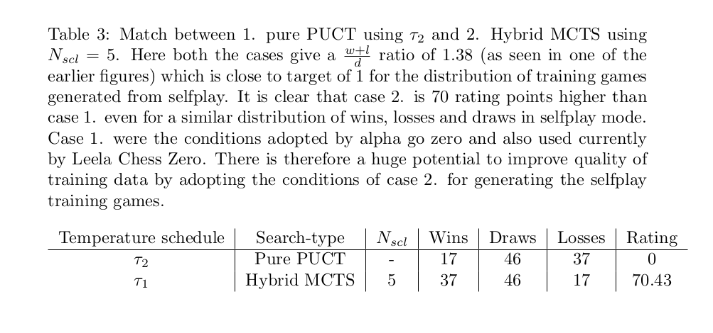
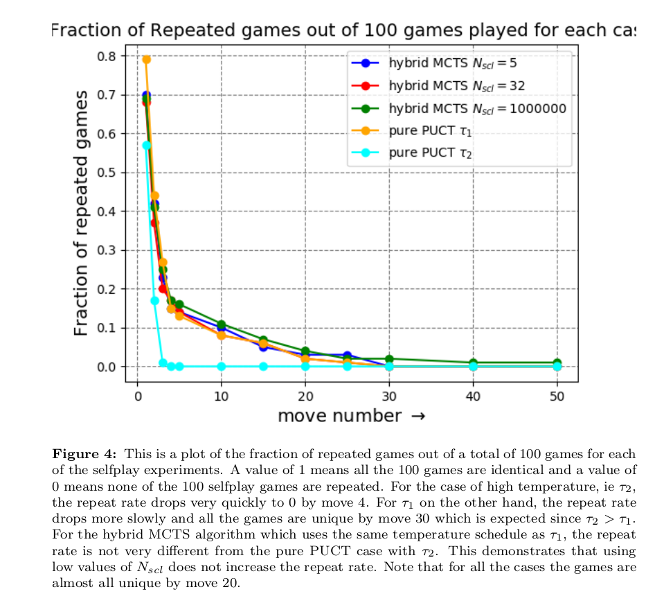
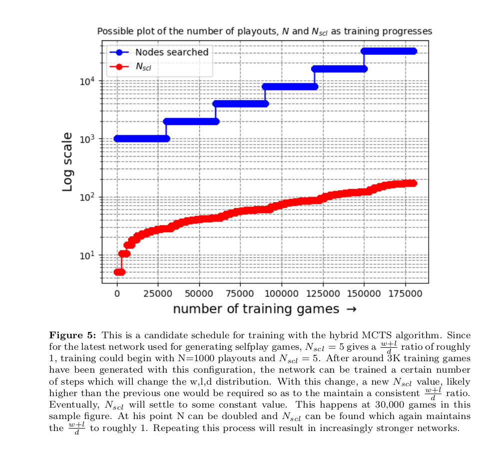
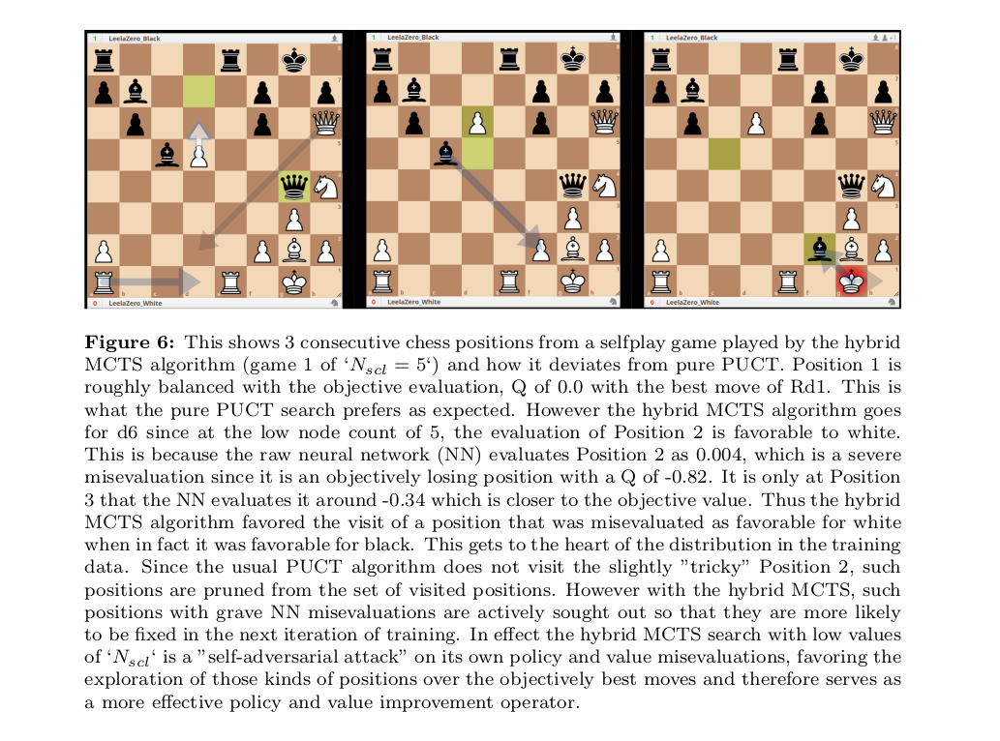

# Search-contempt: a hybrid MCTS algorithm for training alphazero-like engines with better compute efficiency

## Abstract

Alphazero in 2017 was able to master chess and other games without human knowledge by playing millions of games against itself, with a computation budget running in 10's of millions of dollars. It used a variant of Monte Carlo Tree Search (MCTS) algorithm, known as PUCT. This document introduces search-contempt, a novel hybrid variant of the MCTS algorithm which fundamentally alters the distribution of positions generated in the training data, generating more "challenging" positions. This algorithm has been proven to give a big boost in strength for engines in Odds Chess (where one side receives an unfavorable position from the start). More significantly, it opens up the possibility of training a self-play based engine, in a much more compute-efficient manner with the number of training games running into 100s of thousands, costing 10s of thousands of dollars (instead of 10s of millions of training games costing millions of dollars as used by alpha zero). This means it may finally be possible to train such a program from zero on standard consumer GPU, even with a very limited compute, cost or time budget.

## Introduction

Conquering chess has been a holy grail and testbed for AI development since its inception. Deep blue, a supercomputer was the first AI system to beat a world champion at chess in classical time control. With development in both hardware and software in the subsequent decades, it became possible to match its level on consumer hardware. However up till that point human knowledge had to be hardcoded into its software to help it play at a high level, an approach adopted by Stockfish, which was the strongest engine at the time. Alphazero changed that in 2017 by mastering chess without human knowledge, and a very simple search algorithm. It was able to do so by playing 10s of millions of games against itself and learning policy and value functions from those games. However, to generate those games required immense amount of compute, costing millions of dollars, something only large corporations could afford. Furthermore, systems trained in such a manner have been notorious for being vulnerable to [adversarial attacks](https://arxiv.org/pdf/2211.00241).

This document introduces search-contempt, a hybrid version of MCTS, and attempts to make the case that huge amounts of compute may no longer be required to reach state-of-the-art playing strength. Very shortly, it might be possible to train such a chess playing entity using only consumer hardware and compute costs within 10s of thousands, instead of millions of dollars. Or alternatively, it could be a possible way to raise the ceiling strength of current chess engines, given a fixed amount of compute budget. In addition, this search technique, could be an important step towards more robust systems that are less vulnerable to adversarial attacks. This algorithm has already been proven to gain significant strength (100-200 ELO) in Odds Chess, a variant of Chess where one side begins the game with a clear disadvantage (ie a missing Knight, Rook or Queen) while the other side plays with all their pieces.

## Related Work

[Alphago zero](https://scispace.com/pdf/mastering-the-game-of-go-without-human-knowledge-19y9mw638s.pdf) introduced the concept of lookahead search inside the Reinforcement Learning Training Loop. It uses an MCTS search on each position encountered during selfplay. Each MCTS search begins with the root node and grows the search tree by one node with every visit. The path taken along the search tree to add a node is decided by a variant of the [PUCT algorithm](https://www.chrisrosin.com/isaim2010final.pdf). Here, $` N(s,a) `$ represents the total number of visits along a certain node, $` s `$ of the tree, after taking action $` a `$. $` Q(s,a) `$ represents the average value of all the leaf nodes that were reached that involved taking action a from state s at some point in its path. The equations for the path to take along the tree is reproduced below for clarity. 

\begin{equation}
U(s,a) = c_{puct} P(s,a) \frac {\sqrt{\sum_{b} N(s,b)}} {1 + N(s,a)}
\end{equation}

\begin{equation}
Q(s,a) = \frac {1} {N(s,a)} \sum_{s'|s,a->s'} V(s')
\end{equation}

\begin{equation}
a= \underset{b}{\mathrm{argmax}} (Q(s,b) + U(s,b))
\end{equation}

Once the required number of visits are complete. A policy $` \pi(a|s_0) `$ determines which move to play. This is given by

\begin{equation}
\pi(a|s_0)=\frac {N(s_0,a)^{1/\tau}} {\sum_b N(s_0,b)^{1/\tau}}
\end{equation}

The variable $` \tau `$, which does not affect the MCTS search, does affect considerably the trajectory of the positions encountered during a game of selfplay. Alphago zero used a low value of $` \tau `$, ie $` \tau_{1} `$ (which results in the best move always being played) to measure the current strength of the engine. However this produces very high quality games with a lot of draws as is expected from strong engines. This is not ideal for training data. To generate variety in training games, the authors choose a high value of $` \tau `$, ie $` \tau_2 `$, which selects with high probability even moves that may not be the best but are good for exploration. This does however weaken the level of play of training games.

With great success, the same puct-based MCTS algorithm was subsequently used for [alpha zero](https://arxiv.org/pdf/1712.01815) as well. However the problem of weak level of play for the training games persists. The proposed hybrid MCTS algorithm introduced next, which is a generalization of the above pure-puct based algorithm, aims to mitigate this effect. Subsequent sections also discuss a couple of additional metrics, not quantified in the alphago series of papers, but which can be effectively used as a quantitative measure of variety in training games. First is the win-loss-draw distribution, which is a concept that has been widely used with great success by [Leela Chess Zero](https://lczero.org/) for training its Neural Networks. Second is the fraction of repeated games. The impact of $` \tau `$ and the search-contempt algorithm on the variety and strength of training games generated is also discussed in those sections.

## Proposed search-contempt Hybrid MCTS algorithm 

The proposed hybrid, asymmetric MCTS search algorithm is a mixture of two components. The first component is pure PUCT as used in the alpha zero paper. The second component is Thompson Sampling. This hybrid algorithm is characterized by a new integer paramter $` N_{scl} `$ (a short hand for search-contempt-node-limit), which defines the search in the following way. For the root node and all nodes corresponding to the player-to-move, ie nodes with even depth ($` d_{s} = 0,2,4,...`$), the pure PUCT algorithm is used to select nodes to explore. For all the nodes corresponding to the opponent, ie nodes with odd depth ($` d_{s} = 1,3,5,...`$) the pure PUCT algorithm is applied until the total nodes visited reaches $` N_{scl} `$. At this point the visit distribution to its child nodes is frozen and stored. The child nodes to visit for any subsequent visits beyond $` N_{scl} `$ is sampled proportional to its visit distribution that was frozen and stored. In other words after $` N_{scl} `$ visits, the visit distribution remains constant, irrespective of how good or bad the child nodes turn out to be. This is in contrast to the pure PUCT algorithm which adjusts the subsequent visit distribution based on how good or bad the child nodes turns out, with more visits assigned to nodes that turn out to be good and less visits assigned to nodes which turn out to be bad.

A mathematical description of this algorithm follows. All notations and parameters retain the same meaning as described in the [alpha go zero](https://scispace.com/pdf/mastering-the-game-of-go-without-human-knowledge-19y9mw638s.pdf) paper. Only 4 notational additions are made which are 1. $` d_{s} `$, which is the depth of the node to explore, 2. $` N_{scl} `$, a new search parameter which is the visit count at which the hybrid algorithm transitions from pure PUCT to Thompson Sampling, 3. $` N_{scl}(s,a) `$, which is the "frozen" node count associated with a particular action (ie a child node), and 4. $` P_{mcts}(s,a) `$, which is the probability of selecting an action during a single visit of an MCTS simulation. Note this is different from either $` P(s,a) `$, which is the prior probability of selecting an action and $` \pi_{a} `$, which is the probability of selecting an action at the root node after the MCTS search is complete.

$`N_{scl}(s,a)`$ is defined in terms of $` N_{scl} `$ as follows

\begin{equation}
N_{scl}(s,a) = N(s,a), when, \sum_{b} N(s,b) = N_{scl}
\end{equation}

Using the above definition of $`N_{scl}(s,a)`$, $` P_{mcts}(s,a) `$ can be expressed as follows ,

If $` d_{s}mod2 = 0  `$ or $` \sum_{b} N(s,b) <= N_{scl} `$

\begin{equation}
P_{mcts}(s,a)=
    \begin{cases}
        1 & \text{if } a= \underset{b}{\mathrm{argmax}} (Q(s,b) + U(s,b))\\
        0 & \text{if } a \neq \underset{b}{\mathrm{argmax}} (Q(s,b) + U(s,b))
    \end{cases}
\end{equation}

If $` d_{s}mod2 = 1  `$ and $` \sum_{b} N(s,b) > N_{scl} `$ 

\begin{equation}
P_{mcts}(s,a) = \frac {N_{scl}(s,a)} {\sum_{b} N_{scl}(s,b)} = \frac {N_{scl}(s,a)} {N_{scl}}
\end{equation}

All other aspects of the algorithm are identical to the alpha go zero paper. Note that when $` N_{scl} `$ is set to $` \infty `$, equations (6) and (7) reduce to just equation (3), which is equivalent to the pure PUCT algorithm used in alpha go zero.

Figure 1 shows a snapshot of a possible search tree using the Hybrid MCTS search and demonstrates the application of the equations (1) to (7) indicating the conditions under which a node transistions from PUCT to Thompson Sampling. This hybrid version of MCTS markedly affects the distibution of positions visited and the moves played during training game generation as detailed in the following sections.

Implementation of the above algorithm is at this link [https://github.com/amjshl/lc0_v31_sc](https://github.com/amjshl/lc0_v31_sc), which also contains the instructions to reproduce the results of the selfplay and match games described in the following sections. This branch was committed from a clone of [v31](https://github.com/LeelaChessZero/lc0/tree/release/0.31) of the Leela Chess Zero project, an open source implementation of alphagozero-like family of engines.

## Rating Improvement in Odds Chess

 Odds chess is a variant of chess where one of the players, the odds giver, has a severe handicap of a missing piece (a missing Knight, Rook or Queen) while the other player, the odds receiver plays with the full set of pieces. Up until as recently as 2023, even the top engines were not able to consistently beat high-rated players (> FIDE 2000) in odds chess. This changed recently with several innovations, discussed in this [blog](https://lczero.org/blog/) by the Leela Chess Zero team, like [wdl contempt](https://lczero.org/blog/2023/07/the-lc0-v0.30.0-wdl-rescale/contempt-implementation/), and specially trained [Knight Odds](https://github.com/Marcogio9/LeelaKnightOdds) and [Queen Odds](https://github.com/notune/LeelaQueenOdds) network, causing a large increase in playing strength and more notably a change in playing style, making the Leela Chess Zero the strongest rated engine for odds chess in history.

 However, it still used pure PUCT for its MCTS search, which suffered from a strange phenomenon. The odds play gets better as more nodes are searched, but only upto a certain point, after which the search outcome or playstyle begins to resemble the strongest engines in non-odds chess which are weaker in odds chess. Hence, for the default MCTS algorithm, the total nodes searched per move had to be limited in order to optimize playing strength for odds chess. Historically this was around 800 nodes for queen odds, 10,000 nodes for rook odds and 20,000 nodes for knight odds chess.

This phenomenon is best illustrated with the following table which shows the Queen Odds results with pure PUCT search. As the Nodes searched at the root is increased, playing strength against a fixed opponent first increases, reaches a maximum at a certain value and then drops on further increase.

The performance of the search-contempt hybrid version of MCTS shown below does not suffer from a similar drop in strength as Nodes searched is increased.

The reason that the hybrid mcts does not suffer from this effect is that by freezing the distribution of visits for the opponent's play, we maintain the imperfect play expected of the human opponent while simultaneously allowing for higher number of visits for the side giving odds (lets say player 1), thereby increasing the strength of player 1 relative to the opponent. With the inclusion of search-contempt hybrid MCTS, the leela family of odds engine bots gained an additional 100-200 ELO against humans online.

## Compute Efficient Alphazero with search-contempt

Alpha go zero trained on upto 29 million games for their larger model, while alpha zero was trained on 44 million games to exceed the level of stockfish 8, the reigning TCEC chess champion at the time. The estimated cost of training such an engine was likely in the range of 10s of millions of dollars. This can be significantly reduced by using the hybrid version of MCTS instead of the pure PUCT as was used by alpha zero, and currently by the open source Leela Chess Zero.

 $` N_{scl} `$, the new parameter introduced in the hybrid algorithm, can act as an additional lever to vary, both the distribution of positions visited in the training games that are generated and also the distribution of the outcome of the games, ie the percentage of wins(w), losses(l), and draws(d). This is in addition to the $` \tau `$ parameter used in alpha go zero. Figure 2. shows how the w,l,d distribution is affected by the choice of $` N_{scl} `$. Note that all values of $` N_{scl} `$ use the same amount of total compute as that of the pure PUCT algorithm.

 For $` N_{scl} =1000000 `$, which is equivalent to the pure PUCT algorithm, the quality of play is high, but the games mostly end in a draw. Since training games require a roughly equal distribution of w-d-l, this is not the setting that can used for generating selfplay games. However there is a value of $` N_{scl} `$ (found by experimentally varying it), for which the resulting w-d-l distribution is well suited for training. This value is around $` N_{scl} = 5 `$ where the $` \frac {w+l} {d} `$ ratio is close to 1. 

 The links for the sets of self-play games that were used in Figure 2. are given below.

[Nscl=5](./files/hybrid_selfplay_Nscl_5_N_1000.pgn)  
[Nscl=10](./files/hybrid_selfplay_Nscl_10_N_1000.pgn)   
[Nscl=32](./files/hybrid_selfplay_Nscl_32_N_1000.pgn)   
[Nscl=1000000](./files/hybrid_selfplay_Nscl_1000000_N_1000.pgn)  

Qualitatively, the games are of a completely different nature with different $` N_{scl} `$'s. For high values of $` N_{scl} `$ the games are of high quality but very limited in variety. Most games are similar and both sides are quick to exchange off pieces and liquidate to a drawn endgame. This resembles the quality of games that is expected of top engines performing search at 1000 nodes per move. As $` N_{scl} `$ gets closer and closer to the optimal value of 5, the nature of the games completely changes. The quality reduces but almost every game features a lot more complications involving piece imbalances, trapped pieces, perpetual checks, long-term piece sacrifices, dynamic stalements, desperado tactics, checkmates at the middle of the board, and many more 2 or 3-move tactics. Almost every position has something interesting about it.  

Here is an explanation for the shift in the nature of the games as $` N_{scl} `$ is reduced. This parameter clearly alters the visit distribution favoring exploration of the moves for which the opponent (which in the case of selfplay is itself) misevaluates the position at lower nodes compared to higher nodes. The greater the difference in evaluation the more likely the move is to be explored. Not only does it play out unusual positions, it actively seeks out positions which the network is bad at evaluating or searching, but which are absent or less frequent in the games generated using pure mcts. A quick scan of the selfplay games suggests that the frequency of "interesting" positions is about 20-30 times higher with the lower value of $` N_{scl} `$.

This is very different from the way alpha go zero achieved variety. It used temperature, $` \tau `$ as a lever for changing the w-d-l distribution of training games. This is shown in Figure 3. The lower temperature $` \tau_1 `$, produces high-quality games but results in mostly draws while the higher temperature $` \tau_2 `$, trades off the quality of play for more variety and a better w-d-l distribution. Not surprisingly, this prompted the use of $` \tau_1 `$ for optimizing strength in competitive matches and the use of $` \tau_2 `$ for generation of training games.

The link to the games with pure PUCT but different $` \tau's `$ are below:

[Tau 1](./files/pure_PUCT_tau_1.pgn)  
[Tau 2](./files/pure_PUCT_tau_2.pgn)   

It turns out that varying $` N_{scl} `$ is a much more effective way of generating a balanced w-d-l distribution than is $` \tau `$. These two methods were compared with configurations that produced $` \frac {w+l} {d} `$ ratio that was close to 1, ie 1.38 for both the cases. $` N_{scl} =5 `$ outperformed $` \tau_2 `$ by 70 rating points despite using similar compute power. The details are given in Table 3. This means that the quality of training games generated by varying $` N_{scl} `$ is greater than that generated by varying $` \tau `$, which in turn means that networks can improve at a faster rate during training and achieve a higher ceiling. Also as training progresses, the value of  $` N_{scl} `$ is expected to increase and therefore the rating difference of selfplay games is expected to increase beyond even 70 points.

Link to the 100-game match in Table 3 is below,

[pure PUCT tau 2 vs hybrid Nscl 5](./files/pure_PUCT_tau_2_vs_hybrid_Nscl_5.pgn)

Despite the better quality of play, this new parameter cannot completely replace the role of Temperature. Temperature would still be required in training in order to avoid repetition of games. However, the ability to control $` \frac {w+l} {d} `$  using $` N_{scl} `$ in addition to $` \tau `$ enables much more flexibility in the choice of temperature schedule in training. The temperature lever can be can be adjusted to get a good variety early on in the game while still maintaining a high draw rate and thus the quality of games. Once $` \tau `$ is determined, $` N_{scl} `$ could be used to tune the $` \frac{w+l} {d} `$ ratio to close to 1, since its negative impact on level of play is lower than that of $` \tau `$. The fact that the value of $` N_{scl} `$ does not increase the number of repetitions in the training games is illustrated in Figure 4.

The significant impact, that the limited number of training games (~200000) had on the strength and playing style of specialized Odds Chess Networks by Leela Chess Zero, points to the fact that with careful control on the training schedule and parameters, very quick progress on playing strength can be made if training data is generated using search-contempt. Likely using similar training schedules and number of games as the Odds Networks, playing strength rivalling that of the current best networks can likely be achieved for standard chess as well. This amount of compute seems well within the reach of modern consumer hardware. A plausible training schedule using the hybrid version of MCTS to train increasingly stronger networks is indicated in Figure 5. With the amount of compute available for large-scale projects such as alpha zero and Leela Chess Zero, the limits of peak strength of chess engines can be further stretched with the hybrid MCTS.

One interesting instance of how the hybrid MCTS changes the distribution of the training games generated is shown in Figure 6. The hybrid MCTS algorithm favors the visit of positions which are misevaluated by the NN policy and value, which are usually what humans would qualitively classify as "interesting", "complicated", "dynamic" or "unusual".  

## Conclusion

The hybrid version of MCTS (ie search-contempt) has already been proven to give a significant boost to the Leela Chess Zero engine in Odds chess, and is also the search currently used in the leela odds family of bots in lichess.

 In addition, this search provides an alternative way of generating high-quality training data for reinforcement learning by self-play in regular chess as well. The $` N_{scl} `$ parameter serves as a more effective lever for adjusting the w-d-l ratio so that $` \tau `$ that was used by alpha go zero can instead be used as a lever to add the required amount of variety to the training games. This was demonstrated by a match between two different configurations of search, both of which give a reasonable w-d-l ratio. The configurtion which used a low value of $` N_{scl} `$ in the hybrid MCTS instead of a high value of $` \tau `$ in the regular PUCT resulted in stronger play by 70-ELO rating points. 

The type of games generated by the hybrid search suggests that the space of even the "reachable" chess positions explored currently by pure PUCT, although way better than a few years ago, is possibly only a small fraction of that which can likely be explored. Filling out these "holes" in the training data, could improve peak playing strength, reduce compute requirement to a point where existing strength could be achieved with networks trained from scratch on consumer hardware, and also prove to be a means of reducing the susceptibility of such systems to adversarial attacks.

## Acknowledgements 

This work was heavily inspired by the recent progress in odds chess by the Leela Chess Zero (lc0) developer community. Huge credit to Noah, Naphthalin, marcus98, Hissha and many others from the lc0 discord server for the highly insightful discussions and valuable contributions to odds chess play, which served as an inspiration for the idea of search-contempt based hybrid MCTS. The implmentation itself would not have been possible without the lc0 codebase made freely available to the public, provided by the Leela Chess Zero team.  Also, thanks to some other users like Rust who ran independent testing of the strength improvement in odds chess and helped point out bugs in the code. Also credit to those lc0 developers who have painstakingly written, optimized, and refined the lc0 code to a really high degree of performance which allowed for fast execution of the experiments than would otherwise been possible, with limited hardware.

